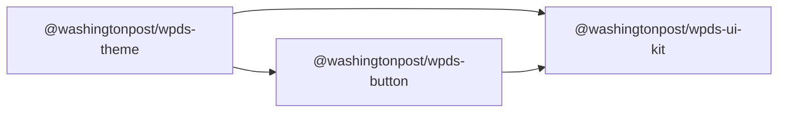

# WPDS's UI Kit

This WPDS UI Kit repo is now a mono-repo that contains not only our UI Kit, but also our build.washingtonpost.com docs site.

 [](https://github.com/WPMedia/wpds-ui-kit/actions/workflows/chromatic-prod.yml) [](https://github.com/WPMedia/wpds-ui-kit/actions/workflows/validation.yml) [](https://github.com/WPMedia/wpds-ui-kit/actions/workflows/latest-release.yml) 


### React frameworks

We are open to adding more React frameworks here. Contact us through our support channels.

- Next.js 9.3.3
- Next.js 10+
- Next.js 11+
- Next.js 12+


## Dependency Graph

An example of the dependency graph for importing Button from Kit.



This project structure is heavily inspired by Chakra UI, Radix UI, and others.

A single import for users, many packages imported in `@washingtonpost/wpds-ui-kit`.

```bash
npm i @washingtonpost/wpds-ui-kit
```

## Additional Information

- Read about how to build a feature for your React site using our UI Kit on our [React Guide](https://build.washingtonpost.com/resources/guides/react-guide).
- If you would like to contribute to you our WPDS UI Kit please refer to the [contribution docs](docs/CONTRIBUTING.md).
- Feel free to reach out to [#wpds on Slack](https://washpost.slack.com/archives/C01FWHF12BG) if you have any questions or run into any problems.
- [Explore the Docs Site](https://build.washingtonpost.com) for usage examples and additional documentation on each component. You can also find additional resources under the [resources](https://build.washingtonpost.com/resources), [guides](https://build.washingtonpost.com/resources/guides), and [support](https://build.washingtonpost.com/support) pages.
- There is also a storybook site that is used for component development only. If you're looking for code examples or information on how to use a specific component, please refer to build.washingtonpost.com.

### Upgrading

- Previous to v0.12 `globalStyles` contained a globally applied transition to all CSS properties on all elements. After upgrading any component element that relied on that transition will need to apply one locally using wpds theme variables.
  ```javascript
  transition: theme.transitions.allFast,
  // or
  transition: `background ${theme.transitions.fast} ${theme.transitions.inOut`
  ```
- Previous to v0.15 `globalStyles` contained a global removal of margin and padding for all elements. After upgrading any component element that relied on having that spacing removed will need to add spacing rules with styles local to the component.
