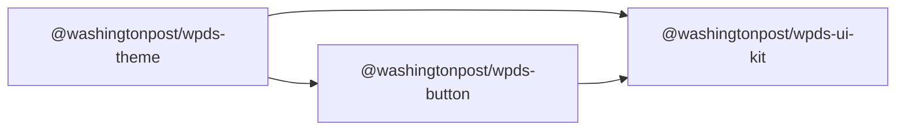

# WPDS's UI Kit


#### [Explore the Docs](https://build.washingtonpost.com)

#### [#wpds on Slack](https://washpost.slack.com/archives/C01FWHF12BG)

This project structure is heavily inspired by Chakra UI, Radix UI, and others.

A single import for users, many packages imported in `@washingtonpost/wpds-ui-kit`.

```bash
npm i @washingtonpost/wpds-ui-kit
```

## [Contributing](docs/CONTRIBUTING.md)

## Dependency Graph

An example of the dependency graph for importing Button from Kit.



## [React Guide](https://build.washingtonpost.com/resources/guides/react-guide)

## Statuses

- [](https://github.com/WPMedia/wpds-ui-kit/actions/workflows/chromatic-prod.yml)
- [](https://github.com/WPMedia/wpds-ui-kit/actions/workflows/validation.yml)
- [](https://github.com/WPMedia/wpds-ui-kit/actions/workflows/latest-release.yml)
