# Current Structure

This map represents our current token mapping structure. Should note that `context` represents the current system context (i.e. dark or light).

### Current supported contexts

- Light
- Dark

### Note

Should note that any base context token can be fixed to be the default value of the default context by adding a suffix of `-static`. The default context is light.

```mermaid
graph LR;
    color-->theme;
    color-->context;

    theme--->primary;
    theme--->onPrimary;
    theme--->secondary;
    theme--->onSecondary;
    theme--->cta;
    theme--->onCta;
    theme--->subtle;
    theme--->faint;
    theme--->accessbile;
    theme--->disabled;
    theme--->onDisabled;
    theme--->signal;
    theme--->error;
    theme--->warning;
    theme--->success;
    theme--->onMessage;

    primary--->gray20;
    onPrimary--->gray700;
    secondary--->gray700;
    onSecondary--->gray20
    cta--->blue100;
    onCta--static---->gray700;
    subtle---->gray300;
    faint--->gray400;
    accessbile--->gray80;
    disabled---->alpha25;
    onDisabled---->alpha50;
    signal--->blue80;
    error--->red100;
    warning--->orange100;
    success--->green100;
    onMessage--static---->gray700;


    context---->alpha25;
    context---->alpha50;

    context---->gray0
    context---->gray20;
    context---->gray40;
    context---->gray60;
    context---->gray80;
    context---->gray100;
    context---->gray200;
    context---->gray300;
    context---->gray400;
    context---->gray500;
    context---->gray600;
    context---->gray700;




    context---->yellow100;
    context---->yellow600;


    context---->gold60;
    context---->gold80;
    context---->gold100;
    context---->gold200;
    context---->gold300;
    context---->gold400;
    context---->gold500;
    context---->gold600;


    context---->mustard60;
    context---->mustard80;
    context---->mustard100;
    context---->mustard200;
    context---->mustard300;
    context---->mustard400;
    context---->mustard500;
    context---->mustard600;

    context---->orange60;
    context---->orange80;
    context---->orange100;
    context---->orange200;
    context---->orange300;
    context---->orange400;
    context---->orange500;
    context---->orange600;


    context---->red60;
    context---->red80;
    context---->red100;
    context---->red200;
    context---->red300;
    context---->red400;
    context---->red500;
    context---->red600;


    context---->pink60;
    context---->pink80;
    context---->pink100;
    context---->pink200;
    context---->pink300;
    context---->pink400;
    context---->pink500;
    context---->pink600;

    context---->purple60;
    context---->purple80;
    context---->purple100;
    context---->purple200;
    context---->purple300;
    context---->purple400;
    context---->purple500;
    context---->purple600;


    context---->teal60;
    context---->teal80;
    context---->teal100;
    context---->teal200;
    context---->teal300;
    context---->teal400;
    context---->teal500;
    context---->teal600;


    context---->green60;
    context---->green80;
    context---->green100;
    context---->green200;
    context---->green300;
    context---->green400;
    context---->green500;
    context---->green600;


    context---->blue40;
    context---->blue60;
    context---->blue80;
    context---->blue100;
    context---->blue200;
    context---->blue300;
    context---->blue400;
    context---->blue500;
    context---->blue600;



```

